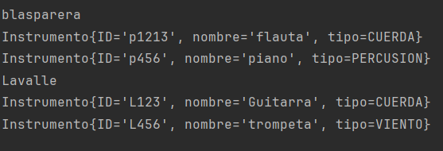

<h1>Fabrica de instrumentos</h1>

Aqui podras ver un demo del proyecto con las incorporaciones realizadas

<h2>Objetivo</h2>

Mejorar ejercitando el manejo de la coleccion de ArrayList
con la utilizacion en proyectos reales

<h3>Clases</h3>

Generemos cuatro clases

<ol>
<li>Fabrica</li>
<li>Sucursales</li>
<li>Instrumentos</li>
<li>Tipo</li>
</ol>

Creamos la logica para poder devolver por consola este resultado, una lista de sucursales con sus instrumentos correspondientes.

